# LR6
Лабораторная работа №6

__Цель лабораторной работы:__ изучение базовых возможностей системы управления версиями, получение опыта работы с Git Api, опыта работы с локальным и удаленным репозиторием.

__Клонирование репозитория на компьютер__

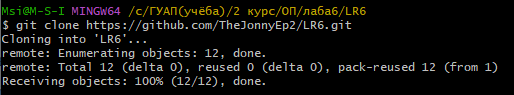

__Добавление файла в репозиторий средствами GitHub__

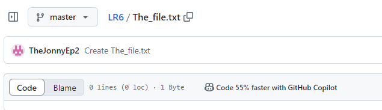

__Подтягиваем изменения в локальный репозиторий__

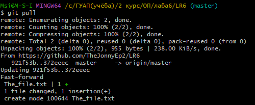

__История операций для ветки master__

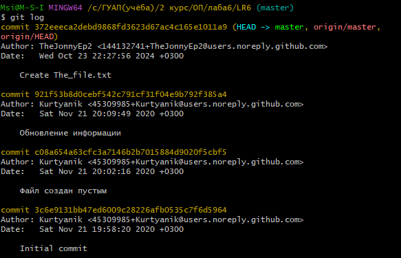

__История операций для ветки branch1__

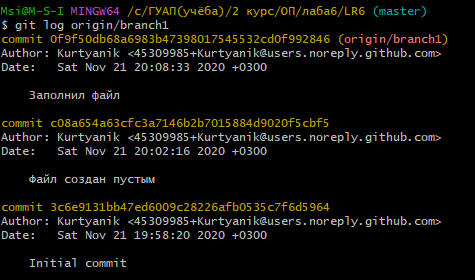

__Попытка слияния__

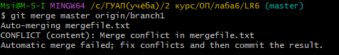

__Разрешение конфликта слияния__

В процессе разрешения конфликта слияния было принято решение изменить mergefile.txt в mater, как он представлен в ветке branch1

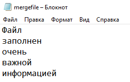

__Коммит о слиянии веток__

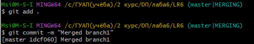

__Удаление ветки__

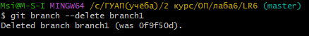

__Добавление папки со скриншотами в репозиторий__

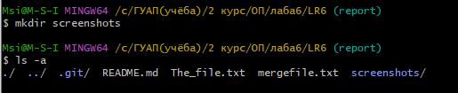

__Создание ветки для отчёта__

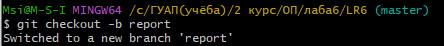